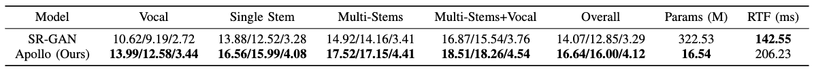

<p align="center">
  
</p>

<p align="center">
  <strong>Kai Li<sup>1,2</sup>, Yi Luo<sup>2</sup></strong><br>
    <strong><sup>1</sup>Tsinghua University, Beijing, China</strong><br>
    <strong><sup>2</sup>Tencent AI Lab, Shenzhen, China</strong><br>
  <a href="https://arxiv.org/abs/2409.08514">ArXiv</a> | <a href="https://cslikai.cn/Apollo/">Demo</a>

<p align="center">
  
  
  
</p>

<p align="center">

# Apollo: Band-sequence Modeling for High-Quality Audio Restoration

## 📖 Abstract

Audio restoration has become increasingly significant in modern society, not only due to the demand for high-quality auditory experiences enabled by advanced playback devices, but also because the growing capabilities of generative audio models necessitate high-fidelity audio. Typically, audio restoration is defined as a task of predicting undistorted audio from damaged input, often trained using a GAN framework to balance perception and distortion. Since audio degradation is primarily concentrated in mid- and high-frequency ranges, especially due to codecs, a key challenge lies in designing a generator capable of preserving low-frequency information while accurately reconstructing high-quality mid- and high-frequency content. Inspired by recent advancements in high-sample-rate music separation, speech enhancement, and audio codec models, we propose Apollo, a generative model designed for high-sample-rate audio restoration. Apollo employs an explicit **frequency band split module** to model the relationships between different frequency bands, allowing for **more coherent and higher-quality** restored audio. Evaluated on the MUSDB18-HQ and MoisesDB datasets, Apollo consistently outperforms existing SR-GAN models across various bit rates and music genres, particularly excelling in complex scenarios involving mixtures of multiple instruments and vocals. Apollo significantly improves music restoration quality while maintaining computational efficiency.

## 🔥 News

- [2025.03.07] We released the training data preprocessing code on [Apollo-data-preprocess](https://github.com/JusperLee/Apollo-data-preprocess).
- [2024.09.10] Apollo is now available on [ArXiv](#) and [Demo](https://cslikai.cn/Apollo/).
- [2024.09.10] Apollo checkpoints and pre-trained models are available for download.

## ⚡️ Installation

clone the repository

```bash
git clone https://github.com/JusperLee/Apollo.git && cd Apollo
conda create --name look2hear --file look2hear.yml
conda activate look2hear
```

## 🖥️ Usage

### 🗂️ Datasets

Apollo is trained on the MUSDB18-HQ and MoisesDB datasets. To download the datasets, run the following commands:

```bash
wget https://zenodo.org/records/3338373/files/musdb18hq.zip?download=1
wget https://ds-website-downloads.55c2710389d9da776875002a7d018e59.r2.cloudflarestorage.com/moisesdb.zip
```
During data preprocessing, we drew inspiration from music separation techniques and implemented the following steps:

1. **Source Activity Detection (SAD):**  
   We used a Source Activity Detector (SAD) to remove silent regions from the audio tracks, retaining only the significant portions for training.

2. **Data Augmentation:**  
   We performed real-time data augmentation by mixing tracks from different songs. For each mix, we randomly selected between 1 and 8 stems from the 11 available tracks, extracting 3-second clips from each selected stem. These clips were scaled in energy by a random factor within the range of [-10, 10] dB relative to their original levels. The selected clips were then summed together to create simulated mixed music.

3. **Simulating Dynamic Bitrate Compression:**  
   We simulated various bitrate scenarios by applying MP3 codecs with bitrates of [24000, 32000, 48000, 64000, 96000, 128000]. 

4. **Rescaling:**  
   To ensure consistency across all samples, we rescaled both the target and the encoded audio based on their maximum absolute values.

5. **Saving as HDF5:**  
   After preprocessing, all data (including the source stems, mixed tracks, and compressed audio) was saved in HDF5 format, making it easy to load for training and evaluation purposes.

### 🚀 Training
To train the Apollo model, run the following command:

```bash
python train.py --conf_dir=configs/apollo.yml
```

### 🎨 Evaluation
To evaluate the Apollo model, run the following command:

```bash
python inference.py --in_wav=assets/input.wav --out_wav=assets/output.wav
```

## 📊 Results

*Here, you can include a brief overview of the performance metrics or results that Apollo achieves using different bitrates*


*Different methods' SDR/SI-SNR/VISQOL scores for various types of music, as well as the number of model parameters and GPU inference time. For the GPU inference time test, a music signal with a sampling rate of 44.1 kHz and a length of 1 second was used.*


## License

<a rel="license" href="http://creativecommons.org/licenses/by-sa/4.0/"></a><br />This work is licensed under a <a rel="license" href="http://creativecommons.org/licenses/by-sa/4.0/">Creative Commons Attribution-NonCommercial-ShareAlike 4.0 International License</a>.

## Third Party

[Apollo-Colab-Inference](https://github.com/jarredou/Apollo-Colab-Inference)

## Acknowledgements

Apollo is developed by the **Look2Hear** at Tsinghua University.

## Citation

If you use Apollo in your research or project, please cite the following paper:

```bibtex
@inproceedings{li2025apollo,
  title={Apollo: Band-sequence Modeling for High-Quality Music Restoration in Compressed Audio},
  author={Li, Kai and Luo, Yi},
  booktitle={IEEE International Conference on Acoustics, Speech and Signal Processing (ICASSP)},
  year={2025},
  organization={IEEE}
}
```

## Contact

For any questions or feedback regarding Apollo, feel free to reach out to us via email: `tsinghua.kaili@gmail.com`
