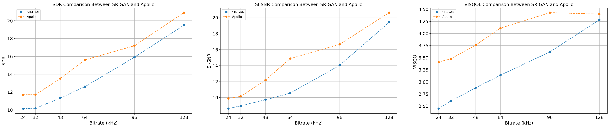
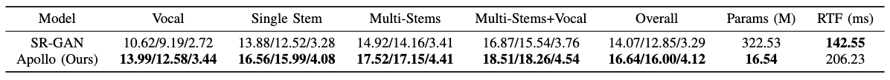

<p align="center">
  
</p>

<p align="center">
  <strong>Kai Li<sup>1,2</sup>, Yi Luo<sup>2</sup></strong><br>
    <strong><sup>1</sup>清華大學，中國北京</strong><br>
    <strong><sup>2</sup>騰訊 AI Lab，中國深圳</strong><br>
  <a href="https://arxiv.org/abs/2409.08514">ArXiv</a> | <a href="https://cslikai.cn/Apollo/">展示頁面</a>

<p align="center">
  
  
  
</p>

# Apollo：用於高品質音訊修復的頻帶序列建模

<p align="center">
  <a href="README.md">English</a> | <a href="README.zh-TW.md">繁體中文</a>
</p>

> 為方便臺灣及其他使用繁體中文的讀者閱讀，也希望讓更多人有機會認識
> Apollo，我們冒昧補上一份繁體中文譯本。若這項補充與專案目前的文件
> 規劃不一致，敬請維護者包涵，也歡迎隨時指正；所有技術內容仍以
> [英文 README](README.md) 為準。

## 📖 摘要

隨著先進播放裝置帶動高品質聆聽體驗的需求，以及生成式音訊模型能力
持續提升，高傳真音訊變得更加重要，音訊修復在現代社會中的重要性也
日益增加。音訊修復通常是從受損輸入預測未失真的音訊，並經常使用 GAN
架構進行訓練，以平衡感知品質與失真。音訊劣化主要集中在中、高頻範圍，
尤其常由編解碼器造成；因此，核心挑戰在於設計一個既能保留低頻資訊，
又能精確重建高品質中、高頻內容的生成器。

受到近期高取樣率音樂分離、語音增強及音訊編解碼器模型進展的啟發，
我們提出 Apollo，一個專為高取樣率音訊修復設計的生成式模型。Apollo
使用明確的**頻帶分割模組**建立不同頻帶之間的關係，產生**更連貫且
品質更高**的修復音訊。在 MUSDB18-HQ 與 MoisesDB 資料集上的評估顯示，
Apollo 在多種位元率與音樂類型中持續優於既有 SR-GAN 模型，尤其擅長
處理多種樂器與人聲混合的複雜情境。Apollo 在維持運算效率的同時，也
顯著提升音樂修復品質。

## 🔥 最新消息

- [2025.03.07] 已在 [Apollo-data-preprocess](https://github.com/JusperLee/Apollo-data-preprocess) 發布訓練資料前處理程式碼。
- [2024.09.10] Apollo 已發布於 [ArXiv](#) 及[展示頁面](https://cslikai.cn/Apollo/)。
- [2024.09.10] Apollo checkpoint 與預訓練模型已可下載。

## ⚡️ 安裝

複製此儲存庫：

```bash
git clone https://github.com/JusperLee/Apollo.git && cd Apollo
conda create --name look2hear --file look2hear.yml
conda activate look2hear
```

## 🖥️ 使用方式

### 🗂️ 資料集

Apollo 使用 MUSDB18-HQ 與 MoisesDB 資料集進行訓練。請執行以下指令下載：

```bash
wget https://zenodo.org/records/3338373/files/musdb18hq.zip?download=1
wget https://ds-website-downloads.55c2710389d9da776875002a7d018e59.r2.cloudflarestorage.com/moisesdb.zip
```

資料前處理參考了音樂分離技術，並包含以下步驟：

1. **音源活動偵測（Source Activity Detection，SAD）：**
   使用 SAD 移除音軌中的靜音區段，只保留重要內容作為訓練資料。

2. **資料增強：**
   透過混合不同歌曲的音軌即時進行資料增強。每次混合會從 11 條可用
   音軌中隨機選取 1 至 8 個 stems，並各自擷取 3 秒片段。相對於原始
   音量，每個片段會套用 [-10, 10] dB 範圍內的隨機能量縮放，再將所有
   片段相加，建立模擬的混合音樂。

3. **模擬動態位元率壓縮：**
   套用位元率為 [24000, 32000, 48000, 64000, 96000, 128000] 的 MP3
   編解碼器，以模擬不同位元率情境。

4. **重新縮放：**
   為確保所有樣本的一致性，依據最大絕對值重新縮放目標音訊與編碼後
   音訊。

5. **儲存為 HDF5：**
   前處理完成後，所有資料（包括來源 stems、混合音軌及壓縮音訊）都會
   儲存為 HDF5 格式，方便訓練與評估時載入。

### 🚀 訓練

執行以下指令訓練 Apollo 模型：

```bash
python train.py --conf_dir=configs/apollo.yml
```

### 🎨 評估

執行以下指令評估 Apollo 模型：

```bash
python inference.py \
  --in_wav=asserts/input_wav.wav \
  --out_wav=output.wav \
  --device=auto
```

`--device=auto` 會依序優先選擇 CUDA、Apple Silicon MPS，最後才使用
CPU。預設會從 Hugging Face 下載官方 `JusperLee/Apollo` checkpoint。
如需使用自訂 checkpoint，`--checkpoint` 僅接受已存在的本機檔案；
由於上游 checkpoint 載入器會使用 PyTorch 反序列化，因此會拒絕任意
遠端儲存庫。經過實測的 MPS 設定與目前限制，請參閱
[Apple Silicon macOS 說明](MACOS_ARM64.md)。

## 📊 結果

*此處可加入 Apollo 在不同位元率下的效能指標或結果摘要。*



*不同方法在各類音樂上的 SDR、SI-SNR、VISQOL 分數，以及模型參數量與
GPU 推論時間。GPU 推論時間測試使用取樣率 44.1 kHz、長度 1 秒的音樂
訊號。*



## 授權條款

<a rel="license" href="http://creativecommons.org/licenses/by-sa/4.0/"></a><br />本作品採用 <a rel="license" href="http://creativecommons.org/licenses/by-sa/4.0/">Creative Commons 姓名標示－相同方式分享 4.0 國際授權條款</a>。

## 第三方專案

[Apollo-Colab-Inference](https://github.com/jarredou/Apollo-Colab-Inference)

## 致謝

Apollo 由清華大學的 **Look2Hear** 團隊開發。

## 引用

若您在研究或專案中使用 Apollo，請引用以下論文：

```bibtex
@inproceedings{li2025apollo,
  title={Apollo: Band-sequence Modeling for High-Quality Music Restoration in Compressed Audio},
  author={Li, Kai and Luo, Yi},
  booktitle={IEEE International Conference on Acoustics, Speech and Signal Processing (ICASSP)},
  year={2025},
  organization={IEEE}
}
```

## 聯絡方式

如有任何 Apollo 相關問題或意見，歡迎寄信至 `tsinghua.kaili@gmail.com`。
